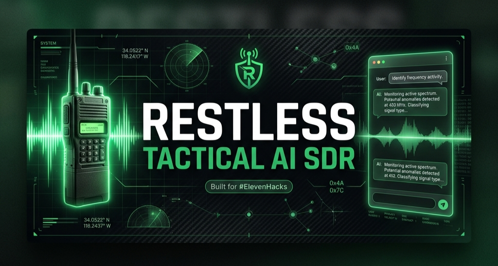

<p align="center">
  
</p>

<h1 align="center">☠️ RESTLESS — Tactical AI SDR</h1>

<p align="center">
  <strong>The AI sales rep that lives on your landing page — disguised as a military radio.</strong>
</p>

<p align="center">
  <a href="https://restless-redesign.vercel.app"></a>
  <a href="#elevenhacks"></a>
</p>

<p align="center">
  
  
  
  
  
  
</p>

---

## 💀 The Problem

DTC landing pages are broken. They **talk AT you**, not **WITH you**.

Your customer lands, skims, bounces. No one reads the FAQ. No one clicks "What's Inside." They just leave.

**The result?** Massive ad spend. High bounce rates. Zero engagement.

## 🎯 The Solution

We built a **tactical AI SDR** (Sales Development Rep) that lives on the landing page — disguised as a military radio.

> **Click it. Ask anything. It knows the product, the science, the pricing. It closes.**

The AI agent is trained on every detail of the [Restless Energy Blend](https://restlessco.store) — ingredients, benefits, pricing, shipping, comparisons. It doesn't just answer questions, it **handles objections and drives conversions** in real-time voice conversations.

**One landing page. One AI agent. Zero bounce.**

---

## 🏗️ Architecture

```
┌─────────────────────────────────────────────────────────────┐
│                      LANDING PAGE                           │
│  ┌──────────────────────────────────────────────────────┐   │
│  │  Hero ─► Benefits ─► Ingredients ─► Testimonials     │   │
│  │  ─► Guarantee ─► FAQ ─► Footer                      │   │
│  └──────────────────────────────────────────────────────┘   │
│                                                             │
│  ┌─────────────────────────┐    ┌────────────────────────┐  │
│  │   🔘 Tactical Radio FAB │───►│   Radio Comms Panel    │  │
│  │   (Floating Action Btn) │    │  ┌──────────────────┐  │  │
│  │   - Pulse animation     │    │  │ Waveform Canvas  │  │  │
│  │   - Status indicator    │    │  │ (Real-time audio) │  │  │
│  │   - "COMMS" label       │    │  ├──────────────────┤  │  │
│  └─────────────────────────┘    │  │ TX/RX Indicators │  │  │
│                                 │  ├──────────────────┤  │  │
│                                 │  │ MIC | END COMMS  │  │  │
│                                 │  └──────────────────┘  │  │
│                                 └───────────┬────────────┘  │
│                                             │               │
└─────────────────────────────────────────────┼───────────────┘
                                              │
                              ┌───────────────▼───────────────┐
                              │     ElevenLabs Conv. AI       │
                              │  ┌─────────────────────────┐  │
                              │  │ Agent: Restless SDR     │  │
                              │  │ Voice: Custom tactical  │  │
                              │  │ Knowledge: Full product │  │
                              │  │ Goal: Drive conversions │  │
                              │  └─────────────────────────┘  │
                              └───────────────────────────────┘
```

---

## ✨ Features

### 🎙️ Tactical Radio AI Agent
- **Voice-first interaction** — real-time conversational AI via ElevenLabs
- **Military radio UX** — disguised as a floating tactical comms button with pulse animations
- **Live waveform visualization** — canvas-based frequency bars respond to speech in real-time
- **TX/RX indicators** — visual feedback showing who's speaking (transmit vs receive)
- **Mute & end controls** — full session management with status indicators (Online/Linking/Offline)

### 🌊 Premium Landing Page
- **Glassmorphism design system** — three glass tiers (`subtle`, `default`, `strong`) with backdrop blur & noise textures
- **Liquid glass SVG filter** — animated `feTurbulence` displacement map for organic, flowing effects
- **Responsive hero with video** — separate optimized WebM videos for desktop and mobile with gradient overlays
- **Shimmer & glow animations** — premium micro-interactions on CTAs and cards
- **Dark tactical aesthetic** — custom OKLCH color palette with tactical green primary + desert tan secondary

### 📋 Full Product Showcase
- **Ingredients deep-dive** — 6 hero ingredients + 6 supporting vitamins/minerals with interactive cards
- **Benefits grid** — key product differentiators with icon-driven layout
- **Testimonials carousel** — social proof with Embla Carousel
- **FAQ accordion** — Radix UI-powered expandable sections
- **100-Day guarantee banner** — trust-building with risk-free messaging

---

## 🛠️ Tech Stack

| Layer | Technology | Purpose |
|-------|-----------|---------|
| **Framework** | [Next.js 16](https://nextjs.org) | App Router, SSR, file-based routing |
| **UI** | [React 19](https://react.dev) | Component architecture |
| **AI Voice** | [ElevenLabs Conversational AI](https://elevenlabs.io) | Real-time voice agent via `@elevenlabs/react` |
| **Styling** | [Tailwind CSS 4](https://tailwindcss.com) | Utility-first + custom glassmorphism system |
| **Components** | [Radix UI](https://radix-ui.com) | Accessible accordion, dialog, navigation |
| **Icons** | [Lucide React](https://lucide.dev) | Tactical iconography |
| **Fonts** | [Geist](https://vercel.com/font) | Sans + Mono for the tactical HUD aesthetic |
| **Design** | [v0](https://v0.app) | AI-generated component scaffolding |
| **Analytics** | [Vercel Analytics](https://vercel.com/analytics) | Production performance tracking |
| **Deploy** | [Vercel](https://vercel.com) | Edge deployment, auto-deploy from `main` |

---

## 🚀 Getting Started

### Prerequisites

- Node.js 18+
- pnpm (recommended) or npm
- [ElevenLabs account](https://elevenlabs.io) with a Conversational AI agent

### 1. Clone the repo

```bash
git clone https://github.com/AGI-CEO/restless-redesign.git
cd restless-redesign
```

### 2. Install dependencies

```bash
pnpm install
# or
npm install
```

### 3. Set up environment variables

```bash
cp .env.example .env.local
```

Create a `.env.local` file with:

```env
NEXT_PUBLIC_ELEVENLABS_AGENT_ID=your_agent_id_here
```

> **💡 Getting your Agent ID:** Create a Conversational AI agent at [elevenlabs.io](https://elevenlabs.io/conversational-ai), configure it with your product knowledge base, and copy the Agent ID from the dashboard.

### 4. Run the dev server

```bash
pnpm dev
# or
npm run dev
```

Open [http://localhost:3000](http://localhost:3000) — click the **📻 COMMS** button in the bottom-right to activate the AI agent.

---

## 🗂️ Project Structure

```
restless-redesign/
├── app/
│   ├── globals.css          # Tactical design system (glassmorphism, animations)
│   ├── layout.tsx           # Root layout with TacticalRadioProvider
│   └── page.tsx             # Landing page composition
├── components/
│   ├── effects/
│   │   ├── glass-card.tsx        # Glassmorphism card component (3 variants)
│   │   └── liquid-glass-filter.tsx  # SVG filter for organic glass effects
│   ├── landing/
│   │   ├── tactical-radio-fab.tsx      # ⭐ The AI SDR radio interface
│   │   ├── tactical-radio-provider.tsx # ElevenLabs ConversationProvider
│   │   ├── hero-section.tsx            # Video hero with responsive layouts
│   │   ├── navigation.tsx              # Sticky nav with glass effect
│   │   ├── benefits-grid.tsx           # Product benefits showcase
│   │   ├── ingredients-section.tsx     # Deep-dive ingredient cards
│   │   ├── testimonials-carousel.tsx   # Social proof carousel
│   │   ├── lifestyle-section.tsx       # Lifestyle imagery section
│   │   ├── guarantee-banner.tsx        # 100-day guarantee CTA
│   │   ├── faq-accordion.tsx           # Expandable FAQ
│   │   └── footer.tsx                  # Site footer
│   └── ui/                  # shadcn/ui base components
├── public/
│   ├── images/              # Product & lifestyle imagery
│   └── videos/              # Hero background videos (desktop + mobile WebM)
└── styles/                  # Additional style modules
```

---

## 🧠 How the AI SDR Works

The tactical radio is powered by **ElevenLabs Conversational AI** with a custom-trained agent:

1. **User clicks the radio FAB** → `startSession()` establishes a WebSocket connection
2. **User speaks** → Audio is streamed to ElevenLabs in real-time (TX mode)
3. **Agent responds** → Voice synthesis streams back with product knowledge (RX mode)
4. **Waveform visualization** → `getFrequencyData()` feeds a 32-bar canvas visualizer
5. **Session management** → Mute, unmute, end transmission with full state control

The agent is trained on:
- Complete product ingredient list and dosages
- Scientific research behind each ingredient
- Pricing, shipping, and return policies
- Competitor comparisons and objection handling
- Brand voice and tactical personality

---

## 🎨 Design System

The glassmorphism design system uses **OKLCH color space** for perceptually uniform colors:

```css
/* Tactical Green Primary */
--primary: oklch(0.65 0.18 145);

/* Desert Tan Secondary */
--secondary: oklch(0.75 0.12 55);

/* Glass tiers */
.glass         → blur(20px), 60% opacity
.glass-subtle  → blur(12px), 40% opacity
.glass-strong  → blur(24px), 80% opacity
```

Custom animations include:
- `shimmer` — sweeping highlight across CTAs
- `glow-pulse` — breathing primary-color glow
- `radio-pulse-ring` — expanding rings on the idle radio FAB
- `radio-tx-blink` — TX indicator blink during user speech

---

## 🏆 ElevenHacks

This project was built for the [ElevenLabs Hackathon](https://elevenlabs.io/hackathon) (#ElevenHacks).

**The thesis:** DTC brands spend thousands driving traffic to landing pages that don't convert. What if the landing page could *talk back*? What if it could answer questions, handle objections, and close — all through voice?

We took this concept and wrapped it in a military radio metaphor that matches the brand's tactical identity, creating an experience that feels like calling in on a secure channel rather than chatting with a bot.

### Built With
- [v0](https://v0.app) — AI-generated component scaffolding & iteration
- [ElevenLabs Conversational AI](https://elevenlabs.io) — Real-time voice agent
- [Restless Co.](https://restlessco.store) — The DTC brand we built this for

---

## 📄 License

This project is open source and available under the [MIT License](LICENSE).

---

## 🤝 Contributing

Contributions are welcome! Feel free to:

1. Fork the repo
2. Create a feature branch (`git checkout -b feature/amazing-feature`)
3. Commit your changes (`git commit -m 'feat: add amazing feature'`)
4. Push to the branch (`git push origin feature/amazing-feature`)
5. Open a Pull Request

---

<p align="center">
  <sub>Built with 🪖 by <a href="https://github.com/AGI-CEO">@AGI-CEO</a> for <a href="https://restlessco.store">Restless Co.</a></sub>
</p>
